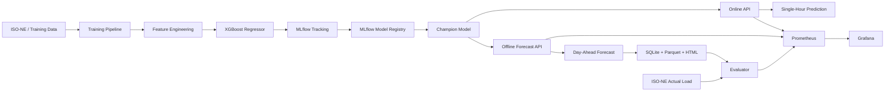
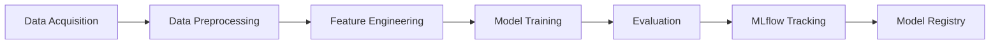
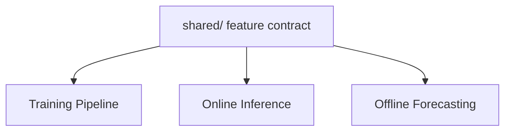
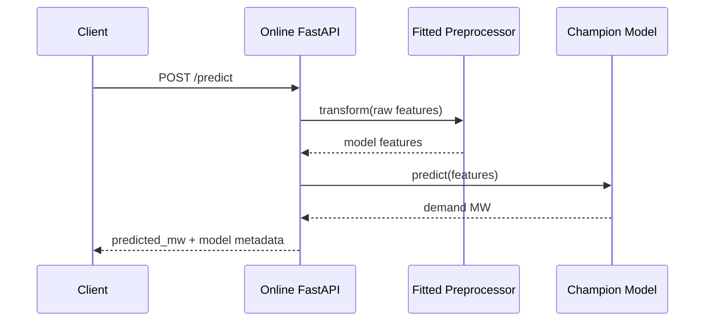
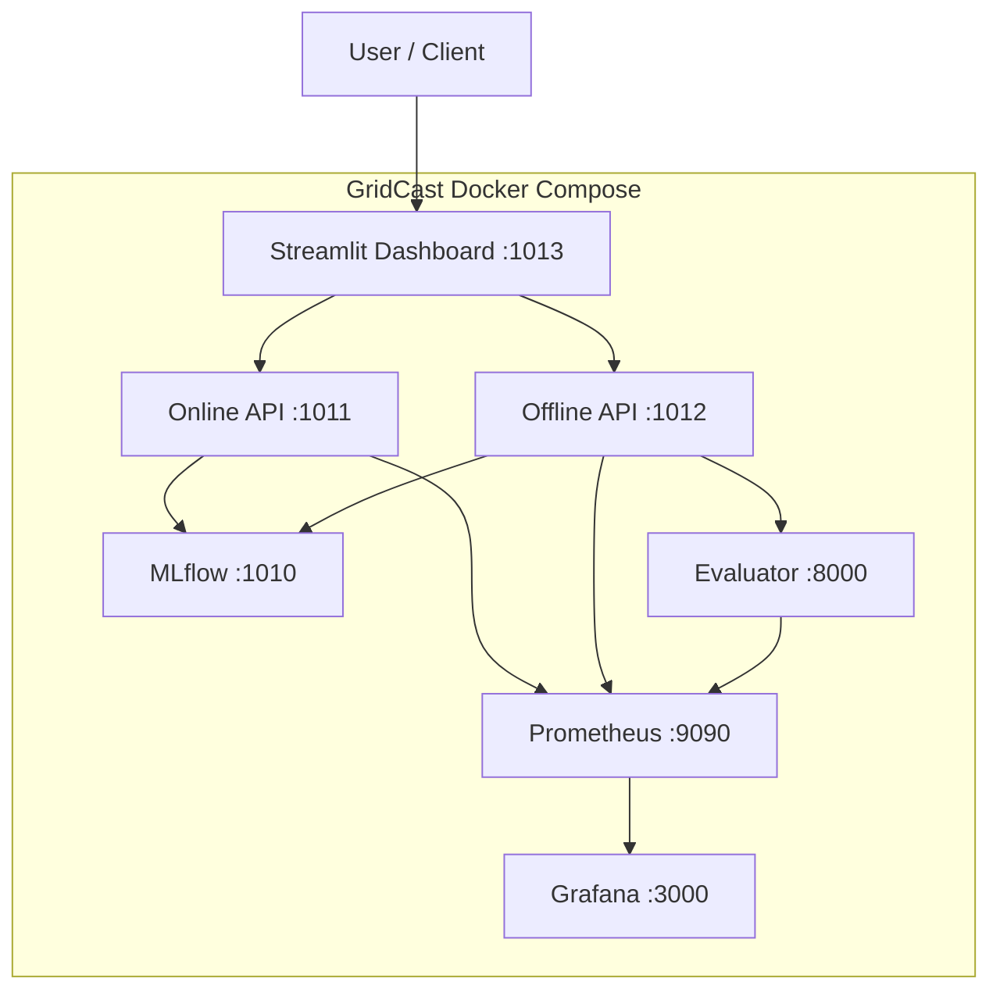
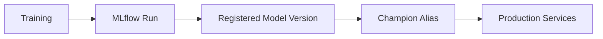
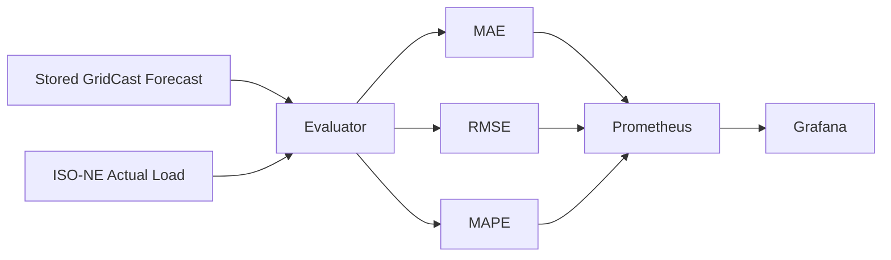
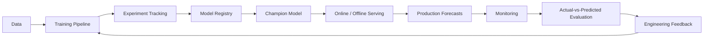

https://github.com/user-attachments/assets/aa40e2de-db91-4dcd-9cd7-25edda7305fd

# ⚡ GridCast

### Production-Grade Electricity Demand Forecasting for ISO New England

<p align="center">
  
  
  
  
  
  
</p>

<p align="center">
  <strong>Train → Register → Serve → Forecast → Monitor → Evaluate</strong>
</p>

---

## 🎯 What is GridCast?

**GridCast** is an end-to-end MLOps system for forecasting hourly electricity demand in the **ISO New England** region.

The project is designed as more than a machine-learning model. It covers the full model lifecycle:

- data acquisition and preprocessing;
- feature engineering;
- model training and experiment tracking;
- model registry and production promotion;
- online single-hour inference;
- offline day-ahead forecasting;
- persisted forecasts and generated reports;
- Dockerized deployment;
- production monitoring with Prometheus and Grafana;
- real model evaluation against ISO-NE actual load.

GridCast is organized around **two complementary environments**:

1. **Development system** — where the model, pipelines, APIs, and shared ML contracts are developed and tested.
2. **Deployment system** — a production-oriented Docker Compose stack containing MLflow, Online API, Offline API, Streamlit dashboard, evaluator, Prometheus, and Grafana.

> This repository was built as part of my work in the **SAIR Jr. MLOps module**.  
> SAIR Jr. identifies MLOps as Module 6 of its AI/ML engineering track.

**SAIR links**

- [SAIR GitHub Organization](https://github.com/SAIR-Org)
- [SAIR Jr.](https://github.com/SAIR-Org/SAIR_Jr)
- [SAIR MLOps](https://github.com/SAIR-Org/SAiR-MLOps)

---

# 🧭 System at a Glance



GridCast separates **training concerns**, **serving concerns**, **forecast-generation concerns**, and **observability concerns** while sharing one model/preprocessing contract.

---

# 🧱 Repository Architecture

The repository is intentionally split into a **development layer** and a **deployment layer**.

```text
GridCast/
│
├── pipeline/                  # Model-development and training pipeline
├── online/                    # Development Online FastAPI service
├── offline/                   # Development Offline forecasting pipeline/API
├── dashboard/                 # Development Streamlit dashboard
├── shared/                    # Shared feature/model contracts
├── Notebooks/                 # Validation and solution notebooks
│
├── GridCast_deployment/       # Production deployment system
│   ├── online/
│   ├── offline/
│   ├── dashboard/
│   ├── monitoring/
│   ├── mlflow/
│   ├── mlruns/
│   ├── offline_data/
│   └── docker-compose.yml
│
├── pyproject.toml
├── uv.lock
└── README.md
```

The current repository structure contains dedicated READMEs for the major development components and a separate deployment area. fileciteturn16file0

---

# 🧪 Part I — Development System

The root-level `pipeline/`, `online/`, `offline/`, `dashboard/`, and `shared/` directories represent the development side of GridCast.

This is where model logic and service behavior are implemented before being packaged into the deployment system.

## 1. Training Pipeline

📘 **Detailed documentation:** [`pipeline/README.md`](pipeline/README.md)

The training pipeline is responsible for turning source data into a registered production model.



Main source structure:

```text
pipeline/
├── config/
│   └── config.py
├── src/
│   ├── data/
│   │   ├── data_acquisition.py
│   │   └── data_preprocessing.py
│   ├── features/
│   │   └── feature_engineering.py
│   └── models/
│       ├── model_training.py
│       └── model_registry.py
├── flow.py
└── main.py
```

### Training responsibilities

The pipeline handles:

- data loading;
- preprocessing;
- feature engineering;
- model fitting;
- evaluation;
- experiment logging;
- artifact logging;
- model registration;
- promotion of the selected production model.

The registered model is:

```text
grid_load_model
```

Production resolves the model through the MLflow alias:

```text
@champion
```

The production system therefore does **not** depend on a permanently hard-coded model version.

---

# 🤖 Model Card

## Problem

GridCast predicts:

```text
System_Load
```

representing electricity demand in megawatts.

## Model Family

```text
XGBRegressor
```

The model is packaged together with the preprocessing artifacts required to reproduce the training-time feature contract during inference.

## Raw Inference Contract

The model-serving input contract uses:

```text
Date
Hr_End
Dry_Bulb
Dew_Point
```

### Meaning

| Feature | Description |
|---|---|
| `Date` | Calendar date used by the time-feature engineering pipeline |
| `Hr_End` | ISO-style hour-ending value |
| `Dry_Bulb` | Dry-bulb air temperature |
| `Dew_Point` | Dew-point temperature |
| `System_Load` | Training target / actual electricity demand |

## Preprocessing

A serialized preprocessing pipeline is used rather than manually rebuilding features in each service.

The preprocessing artifacts include:

```text
ISONETimeFeatureEngineer
RobustScaler
```

This is a critical production design decision:

> **Online and Offline inference reuse the fitted training preprocessor.**

The APIs should not independently recreate training feature-engineering logic, because doing so can create **training-serving skew**.

## Model Registry Contract

```text
Registered model: grid_load_model
Production alias: @champion
```

The Online and Offline services load the production model and its preprocessor from MLflow.

---

# 🧩 Shared ML Contract

The root-level:

```text
shared/
├── feature_engineering.py
└── model_loader.py
```

contains code that should remain consistent across model development and serving.

Its purpose is to prevent the training, Online, and Offline paths from silently implementing different feature logic.



---

# ⚡ 2. Online Inference

📘 **Detailed documentation:** [`online/README.md`](online/README.md)

The Online service provides low-latency, single-hour electricity-demand prediction through FastAPI.

Core endpoints:

```text
GET  /health
POST /predict
GET  /metrics
```

High-level request flow:



The Online API returns the predicted electricity demand together with model registry metadata.

---

# 🌤️ 3. Offline Day-Ahead Forecasting

📘 **Detailed documentation:** [`offline/README.md`](offline/README.md)

The Offline system produces a complete **day-ahead hourly forecast**.

GridCast forecast semantics:

```text
Origin date D
      ↓
Target date D + 1
```

The production Offline service combines the production model with weather inputs and produces 24-hour forecast artifacts when the target day has 24 hourly periods.

High-level flow:


The current production weather integration uses **Open-Meteo** for forecast/replay weather inputs.

Offline outputs are persisted as:

```text
SQLite metadata
Parquet forecast data
HTML reports
MLflow artifacts
```

Important API endpoints include:

```text
POST /forecast
GET  /forecasts
GET  /forecasts/{forecast_id}
GET  /forecasts/target/{target_date}/latest
GET  /forecasts/{forecast_id}/hourly
GET  /forecasts/{forecast_id}/report
GET  /forecasts/{forecast_id}/parquet
GET  /running
GET  /failures
GET  /metrics
```

---

# 📊 4. Development Dashboard

📘 **Detailed documentation:** [`dashboard/README.md`](dashboard/README.md)

The Streamlit application is the user-facing interface for GridCast.

It communicates with:

```text
Online API
Offline API
```

and presents prediction and forecasting workflows without requiring direct interaction with the FastAPI endpoints.

---

# 🚀 Part II — Deployment System

📘 **Deployment documentation:** [`GridCast_deployment/README.md`](GridCast_deployment/README.md)

📘 **Docker validation guide:** [`GridCast_deployment/GridCast_Docker_Test_Guide.md`](GridCast_deployment/GridCast_Docker_Test_Guide.md)

The production-oriented system lives under:

```text
GridCast_deployment/
```

It contains independent Docker services for:

```text
MLflow
Online API
Offline API
Streamlit Dashboard
Evaluator
Prometheus
Grafana
```

Production architecture:



---

# 🐳 Docker Compose Services

| Service | Purpose | Container Port | Host Binding |
|---|---|---:|---|
| `mlflow` | Experiment tracking + model registry | `1010` | `127.0.0.1:1010` |
| `online` | Real-time prediction API | `1011` | `127.0.0.1:1011` |
| `offline` | Day-ahead forecasting API | `1012` | `127.0.0.1:1012` |
| `dashboard` | Streamlit user interface | `1013` | `127.0.0.1:1013` |
| `prometheus` | Metrics collection / TSDB | `9090` | `127.0.0.1:1014` |
| `grafana` | Monitoring dashboards | `3000` | `127.0.0.1:1015` |
| `evaluator` | Model evaluation exporter | `8000` | Docker network only |

Services communicate through Docker Compose DNS names such as:

```text
mlflow:1010
online:1011
offline:1012
evaluator:8000
prometheus:9090
```

---

# 🔬 Experiment Tracking & Model Registry

MLflow is used for two distinct responsibilities.

## Experiment Tracking

Training runs can persist:

```text
parameters
metrics
model artifacts
preprocessing artifacts
feature-importance artifacts
```

## Model Registry

Production services do not choose arbitrary local model files.

They resolve the registered model:

```text
grid_load_model@champion
```

This creates a clean separation:



This allows model promotion without rewriting serving code.

---

# 📡 Monitoring & Observability

📘 **Detailed monitoring documentation:** [`GridCast_deployment/monitoring/README.md`](GridCast_deployment/monitoring/README.md)

GridCast monitoring is split into three dashboards.

## Model Monitoring

Answers:

> Is the model still producing accurate forecasts?

Metrics include:

```text
MAE
RMSE
MAPE
Matched Hours
Evaluator Availability
Evaluation Freshness
```

The evaluator retrieves actual ISO New England hourly system load and compares it against stored GridCast forecasts.

Current metric names include:

```text
gridcast_model_mae_mw
gridcast_model_rmse_mw
gridcast_model_mape_percent
gridcast_evaluation_matched_hours
gridcast_evaluator_last_success_timestamp_seconds
gridcast_evaluator_has_evaluation
```

## Operational Monitoring

Answers:

> Are the production services healthy and responsive?

Examples:

```text
Online / Offline availability
request rate
5xx rate
P95 latency
active requests
endpoint traffic
prediction latency
service health
```

## Business / Product Monitoring

Answers:

> How is the GridCast platform being used?

Examples:

```text
successful prediction requests
offline forecast requests
report downloads
Parquet downloads
feature usage over time
product usage mix
```

---

# 🧮 Real Model Evaluation

GridCast does not stop at infrastructure monitoring.

The evaluator performs **actual-vs-predicted model evaluation**.



Forecast and actual rows are matched by:

```text
Date
Hr_End
```

This distinguishes **service health** from **model health**.

A service can be fully available while the model performs badly, and a model can remain accurate while an API is unavailable. GridCast monitors these concerns separately.

---

# 🛡️ Monitoring Security

Prometheus and Grafana are intentionally not exposed directly to the public Internet.

Current bindings:

```text
Prometheus → 127.0.0.1:1014
Grafana    → 127.0.0.1:1015
```

Grafana can be accessed securely through an SSH tunnel:

```bash
ssh -N \
  -L 11015:127.0.0.1:1015 \
  <user>@<VPS_IP>
```

Then open:

```text
http://127.0.0.1:11015
```

Sensitive files such as evaluator credentials and Grafana credentials are excluded from Git.

---

# 🔐 Secrets

Do not commit:

```text
GridCast_deployment/.env
GridCast_deployment/monitoring/evaluator/.env
```

Typical secret/runtime values include:

```text
GRAFANA_ADMIN_PASSWORD
ISONE_USERNAME
ISONE_PASSWORD
```

Production secrets should be injected at runtime rather than embedded into Docker images or source code.

---

# 🔄 End-to-End MLOps Lifecycle

GridCast follows the complete machine-learning lifecycle:



The key idea is that deployment is **not the end of the ML lifecycle**.

Production behavior and model performance feed back into future model-development decisions.

---

# 🧑‍💻 Development Workflow

The root repository should be used when changing model or service logic.

A typical development flow is:

```text
1. Modify training / feature / service code
2. Run local tests and notebooks
3. Train and evaluate candidate models
4. Log experiments to MLflow
5. Register/promote the selected model
6. Validate Online and Offline inference
7. Update deployment code if required
8. Build Docker images
9. Deploy
10. Validate Prometheus and Grafana
```

For component-specific commands, use the linked README for that component rather than duplicating every command in this root document.

---

# 🧭 Documentation Map

| Area | Purpose | Detailed Documentation |
|---|---|---|
| Training | Data → features → model → registry | [`pipeline/README.md`](pipeline/README.md) |
| Online API | Single-hour prediction serving | [`online/README.md`](online/README.md) |
| Offline Forecasting | Day-ahead forecast generation | [`offline/README.md`](offline/README.md) |
| Dashboard | User-facing Streamlit application | [`dashboard/README.md`](dashboard/README.md) |
| Deployment | Production Docker system | [`GridCast_deployment/README.md`](GridCast_deployment/README.md) |
| Monitoring | Prometheus, Grafana, evaluator | [`GridCast_deployment/monitoring/README.md`](GridCast_deployment/monitoring/README.md) |
| Docker Testing | Deployment validation | [`GridCast_deployment/GridCast_Docker_Test_Guide.md`](GridCast_deployment/GridCast_Docker_Test_Guide.md) |
| Notebooks | Solution and deployment validation | [`Notebooks/`](Notebooks/) |

The root README should explain the system at architecture level.  
Each linked README should contain the implementation details and exact commands for its own component.

---

# 🧰 Technology Stack

| Layer | Technology |
|---|---|
| Language | Python |
| ML Model | XGBoost / `XGBRegressor` |
| Data Processing | pandas + fitted preprocessing pipeline |
| Experiment Tracking | MLflow |
| Model Registry | MLflow Model Registry |
| API Serving | FastAPI + Uvicorn |
| Offline Forecasting | Python service + persisted artifacts |
| UI | Streamlit |
| Persistence | SQLite + Parquet |
| Containerization | Docker + Docker Compose |
| Metrics | Prometheus |
| Dashboards | Grafana |
| Cloud Deployment | Google Cloud VPS |
| Package Management | `uv` / `pyproject.toml` |

---


## Additional Observability

Potential next steps:

```text
Prometheus alert rules
Alertmanager
Node Exporter
cAdvisor
Blackbox Exporter
external uptime probes
SLOs and error budgets
segmented model performance
bias / residual monitoring
```

---

# 🧪 Validation Philosophy

GridCast uses layered validation.

### Model layer

```text
Does the model produce acceptable forecasts?
```

### Application layer

```text
Do Online and Offline APIs behave correctly?
```

### Container layer

```text
Do services start and communicate correctly?
```

### Monitoring layer

```text
Are metrics being scraped and visualized?
```

### Production layer

```text
Can the deployed system perform the complete user workflow?
```

This separation makes failures easier to isolate.

---

# 🎓 Project Context — SAIR MLOps

This project was developed as part of my learning and engineering work in the **SAIR Jr. MLOps module**.

The SAIR Jr. curriculum describes its MLOps module around production ML-system skills including containerization, FastAPI, MLflow, data pipelines, CI/CD, and monitoring.

Useful references:

- **SAIR:** [github.com/SAIR-Org](https://github.com/SAIR-Org)
- **SAIR Jr.:** [github.com/SAIR-Org/SAIR_Jr](https://github.com/SAIR-Org/SAIR_Jr)
- **SAIR MLOps:** [github.com/SAIR-Org/SAiR-MLOps](https://github.com/SAIR-Org/SAiR-MLOps)

---

# 📄 License

See [`LICENSE`](LICENSE) for the repository license.

---

# 📬 Contact

For questions, collaboration, feedback, or technical discussion about GridCast:

**Email:** `abdelhadiosama12@gmail.com`


---

<p align="center">
  <strong>GridCast</strong><br>
  From model development to monitored production forecasting.
</p>
