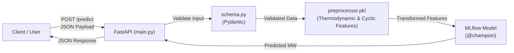

# 🌐 GridCast: Online Real-Time Inference API

[](https://fastapi.tiangolo.com/)
[](https://swagger.io/tools/swagger-ui/)
[](https://www.docker.com/)
[](https://mlflow.org/)

The `online/` directory contains the **real-time prediction microservice** for GridCast. 

While the [`pipeline/`](../pipeline/) directory is responsible for offline training and evaluation, `online/` serves the trained **`@champion`** model as a high-performance REST API built with **FastAPI**. It allows downstream applications, grid operators, and dashboards to request single-hour electricity demand predictions (in Megawatts, MW) for the ISO New England (ISO-NE) power grid on demand.

---

## 📁 What is Inside this Directory?

| File | Role | Description |
| :--- | :--- | :--- |
| [`main.py`](main.py) | **API Application** | Initializes the FastAPI application, loads the model on startup, and exposes `/health` and `/predict` endpoints. |
| [`schema.py`](schema.py) | **Data Validation** | Defines Pydantic models (`GridPredictionRequest`, `GridPredictionResponse`) with field validations and OpenAPI documentation examples. |
| [`model_loader.py`](model_loader.py) | **MLflow Connector** | Connects to the MLflow Model Registry, loads the champion model and preprocessor artifact, and handles path translation for containerized environments. |
| [`Dockerfile`](Dockerfile) | **Containerization** | Packages the application with `python:3.12-slim` and `uv` to run production-ready on port `1010`. |
| [`requirements.txt`](requirements.txt) | **Dependencies** | Minimal production dependencies (`fastapi`, `uvicorn`, `mlflow`, `pandas`, `xgboost`, `catboost`, etc.). |

---

## ⚙️ How the Service Works



1. **Startup**: When the FastAPI service boots, it queries MLflow for the model tagged with the `@champion` alias and deserializes both the trained estimator and the feature engineering pipeline (`preprocessor.pkl`).
2. **Incoming Request**: The client sends a JSON payload with the date, hour, and temperature readings.
3. **Validation & Feature Engineering**: The payload is validated via Pydantic, converted into a DataFrame, and enriched with thermodynamic (Heating/Cooling Degree Hours) and cyclic calendar features.
4. **Prediction**: The model generates the forecasted demand in Megawatts (MW) and returns a structured JSON response.

---

## 🚀 Getting Started

### 1. Prerequisites

Ensure you have a trained model registered in MLflow. If you haven't run the training pipeline yet, execute:

```bash
# From the project root
python pipeline/main.py --promote
```

### 2. Run the API Locally

From the root directory:

```bash
# 1. Activate your virtual environment
source .venv/bin/activate

# 2. Navigate to the online directory
cd online

# 3. Start the server with hot reload
uvicorn main:app --host 0.0.0.0 --port 8000 --reload
```

The API will start at `http://localhost:8000`.


---

## 🖥️ How to Use with Swagger UI

FastAPI automatically generates an interactive **Swagger UI** dashboard. You do not need Postman or `curl` to test the API.

### Step 1: Open the Swagger UI Dashboard

1. Start your API server (e.g., on port `8000`).
2. Open your web browser and navigate to:
   ```text
   http://localhost:8000/docs
   ```
   *(If running via Docker, use `http://localhost:1010/docs`)*

You will see the interactive documentation displaying all available endpoints.

---

### Step 2: Test the Health Check (`GET /health`)

Verify that the service is running and the champion model is loaded:

1. Click on the **`GET /health`** bar to expand it.
2. Click the **"Try it out"** button in the top right.
3. Click the blue **"Execute"** button.
4. View the response under **Responses**:
   ```json
   {
     "status": "ok",
     "model_version": "v1",
     "model_alias": "champion"
   }
   ```

---

### Step 3: Generate a Prediction (`POST /predict`)

Send input features and receive real-time demand predictions:

1. Click on the **`POST /predict`** bar to expand it.
2. Click the **"Try it out"** button.
3. The **Request body** text area will be pre-filled with an example payload:

   ```json
   {
     "Date": "2024-05-15",
     "Hr_End": 14,
     "Dry_Bulb": 72.5,
     "Dew_Point": 60.1
   }
   ```

   **Field Descriptions:**
   - **`Date`** *(string)*: Forecast date in `YYYY-MM-DD` format.
   - **`Hr_End`** *(integer)*: Hour of day ending (between `1` and `24`). E.g., `14` corresponds to 1:00 PM – 2:00 PM.
   - **`Dry_Bulb`** *(number)*: Ambient dry-bulb temperature in degrees Fahrenheit (°F).
   - **`Dew_Point`** *(number)*: Dew-point temperature in degrees Fahrenheit (°F).

4. Modify the values if desired, then click **"Execute"**.
5. Scroll down to view the **Server response** (HTTP `200`):

   ```json
   {
     "predicted_mw": 14520.35,
     "model_version": "v1",
     "model_alias": "champion"
   }
   ```

---

## 🔍 Alternative Documentation: ReDoc

FastAPI also provides an alternative documentation view styled with **ReDoc**.

To view it, visit:
```text
http://localhost:8000/redoc
```

---

## 🧪 Testing via cURL (Alternative)

If you prefer testing directly from your terminal:

```bash
curl -X 'POST' \
  'http://localhost:8000/predict' \
  -H 'accept: application/json' \
  -H 'Content-Type: application/json' \
  -d '{
    "Date": "2024-05-15",
    "Hr_End": 14,
    "Dry_Bulb": 72.5,
    "Dew_Point": 60.1
  }'
```

---

## 🔧 Environment Variables

You can customize the API behavior using the following environment variables:

| Variable | Default Value | Description |
| :--- | :--- | :--- |
| `MLFLOW_TRACKING_URI` | `sqlite:///pipeline/mlflow_gridcast.db` | URI pointing to the MLflow tracking SQLite backend. |
| `MODEL_NAME` | `grid_load_model` | Name of the registered model in MLflow. |
| `MODEL_ALIAS` | `champion` | Alias of the model to serve (e.g., `champion`, `challenger`). |
| `ROOT_PATH` | `""` | Base path prefix when deployed behind a reverse proxy or API gateway. |
| `MLFLOW_ARTIFACTS_ROOT` | *(None)* | Remaps host artifact storage paths to container paths when running in Docker. |
